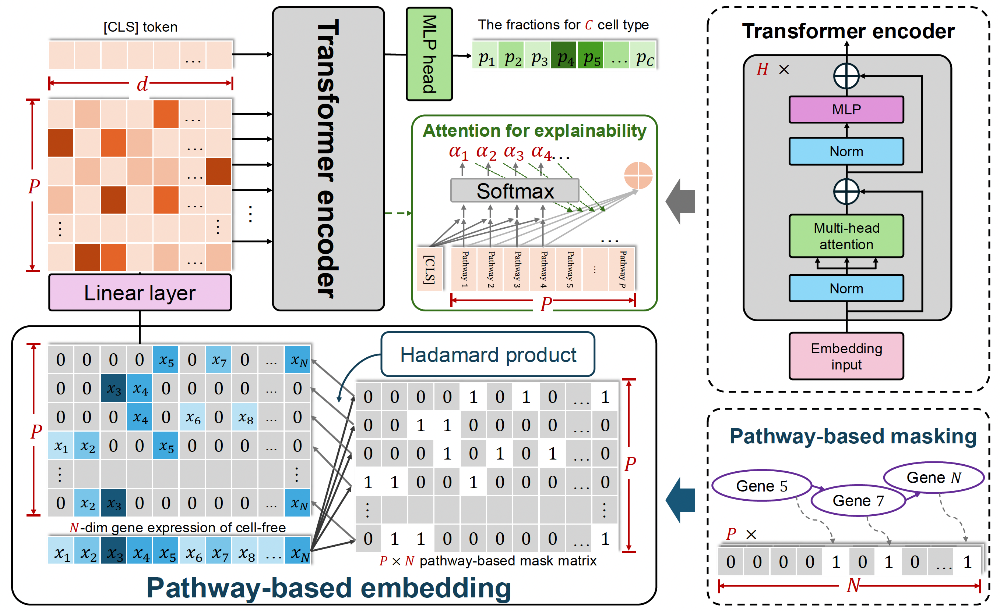

# Deconformer

preprint article : Pathway-enhanced Transformer-based model for robust enumeration of cell types from the cell-free transcriptome

[DOI: 10.1101/2024.02.28.582494](https://doi.org/10.1101/2024.02.28.582494)

## Deconformer model structure


## Requirements

- **OS**: Linux/UNIX/Windows
- **Python Version**: >= 3.10.12
- **Library**:
  - torch >= 2.0.0
  - scanpy >= 1.9.3

## Usage

### Usage 1: only use pre-trained the model to inference cfRNA samples
Inference of cfRNA samples using a pre-trained model does not require a GPU, and about 200 samples can be inferred in 10 minutes on a laptop without a dedicated GPU.

```python
python  deconformer_predict.py  saved_model_path  expression_profile 
```

#### Input:

- `expression_profile`: An expression profile of a cfRNA sample in `CSV` format, for which you need to infer the origin fractions, with rows as gene names and columns as sample names.
- `saved_model_path`: A path for saving pre-trained model parameters and mask matrices (for example, the adult model:  ./model_weights/adult_model/ ).

#### Output:
- `prefix_deconformer_re.txt`: A `txt` named with the prefix of your sample expression profile file followed by '_deconformer_re', where the rows are sample names and the columns are cell type names. It is saved by default in the ./inference_results/ directory.


### Usage 2: Train a model from scratch for custom target cell types
#### step 1: simulate cfRNA smaples
```python
python  deconformer_simulate.py
```
#### step 2: trainning deconformer model
 ```python
python  deconformer_train.py  ann_simulated_data  gmt_file  
```
###### Input:
- `ann_simulated_data`: A `AnnData` object which saved the simulated cfRNA data
- `gmt_file`: A `gmt` file that contains pathway information. This study uses GSEA C5 GOBP pathway, and users may choose other pathway data.
- `project_name`:  Users customize a ` project name`, and the model parameters and mask matrix trained subsequently will automatically be saved in a folder named after this project.
##### Output:
- `model_checkpoint_epoch_n.pt`: A `pt` file that saves the model parameters of the nth epoch.
- `mask_gene_n_pathway_m.txt`: A mask matrix created from the given `gmt` file, where `n` is the number of pathways and `m` is the number of genes.

#### step 3: Infer cfRNA samples, usage as in usage 1.
