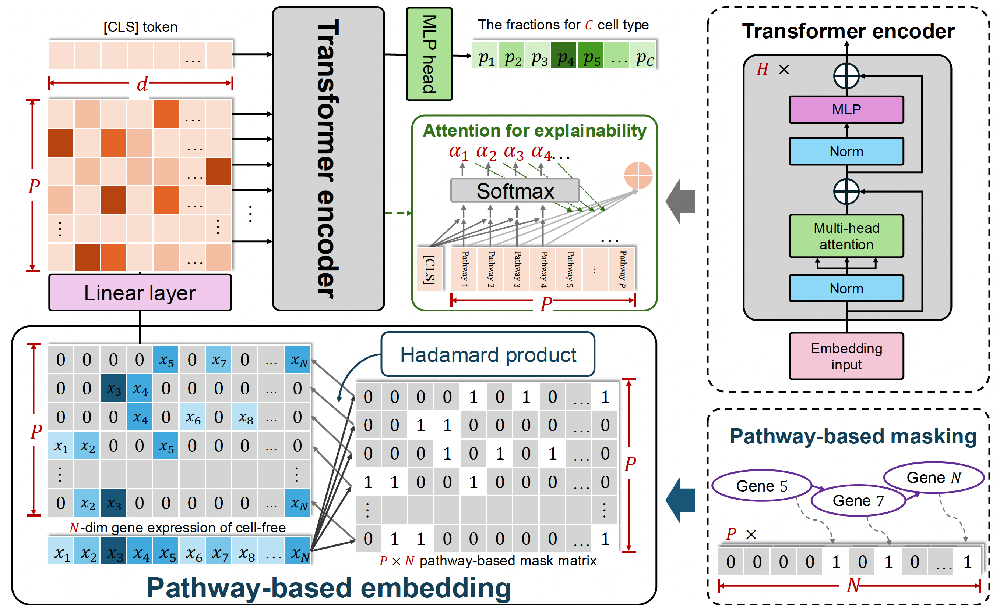

# Deconformer

preprint article : Pathway-enhanced Transformer-based robust model for quantifying cell types of origin of cell-free transcriptome

[DOI: 10.1101/2024.02.28.582494](https://doi.org/10.1101/2024.02.28.582494)

## Deconformer model structure


## Updates

**2026-07-22**: Optimized project code. Simulation data generation, model training, and model inference can now all be configured via command-line arguments. The input format for simulation data generation and model training has been changed from h5ad to HDF5. By leveraging HDF5's chunking mechanism, the simulated expression matrix is no longer loaded entirely into memory, greatly reducing memory requirements and improving efficiency when handling ultra-large simulated datasets. Additionally, through training process optimization, the memory requirement for model training at batch size 64 is now less than 20 GB, making it convenient to train models on consumer-grade GPUs such as the RTX 5090. Only the scripts have been updated; the runtime environment, dependencies, and the structure of trained checkpoints remain unchanged.

## Requirements

- **OS**: Linux/UNIX/Windows
- **Python Version**: >= 3.10.12
- **Library**:
  - torch >= 2.0.0
  - scanpy >= 1.9.3

## Repository Structure

* The root directory of this repository contains all the code for Deconformer.
* The `resource` subdirectory contains data required for model construction, such as the GOBP GMT pathway file, cell type order files, and mRNA gene lists from single-cell reference datasets.
* The `checkpoints` subdirectory contains pre-trained model files for Deconformer, including models for adults, fetals, and pregnancy stages.
* The `inference_results` subdirectory is where Deconformer saves its inference results. It also includes an example of a Deconformer inference output.
* The `example_input` subdirectory contains a sample input file for a cfRNA expression matrix (from [DOI: 10.1126/scitranslmed.aaz013](https://www.science.org/doi/10.1126/scitranslmed.aaz0131)).
* The `gene_model` subdirectory contains the code for Deconformer-gene. This is a variant of Deconformer in which gene embeddings are used instead of pathway embeddings.
* The `Analysis` subdirectory contains downstream analysis and visualization code based on the inference results of Deconformer, as presented in the article.
* The `Dockerfile` subdirectory contains the files used for building the docker image.


## Usage

### Usage 1: Using pre-trained the model to inference cfRNA samples  (recommend)

Thanks to Deconformer's compact model size, inference for approximately 100 samples can be completed within one minute using a laptop CPU, even without a GPU.

> 💡 **Windows User?** Just install WSL 2 and run the standard Linux commands, or use the docker image (Usage 2). [WSL2 user guide](windows_user_guide.md)

#### step1: Install dependencies.

```bash
pip install torch scanpy git
# or use conda:
# conda create -n Deconformer -c conda-forge -y python==3.12 git && conda activate Deconformer && pip install torch scanpy
```

> Note: Since the CPU's computational speed is sufficient for Deconformer, we have installed the CPU-only version of the PyTorch library here. If you need to run Deconformer on a GPU, you can choose to install the GPU-enabled version of PyTorch instead.

#### step2: Download the Deconformer script and model files from GitHub.

```bash
git clone https://github.com/findys/Deconformer.git
```

#### step3: Cell fraction inference from example cfRNA expression profiles using Deconformer

```bash
cd Deconformer
python deconformer_inference.py --model adult_model --input example_input/PE2020.TPM.txt --output inference_results/test_output.txt
```

The inference results will be output to `inference_results/test_output.txt`. Rows represent samples, and columns represent cell types.

Alternatively, you can follow the format of `example_input/PE2020.TPM.txt` and input your cfRNA expression profile.


```
Deconformer Prediction Tool (Optimized for CPU/GPU/MPS)

options:
  -h, --help            show this help message and exit
  --config CONFIG       Path to the model config JSON file. (default: model_configs.json)
  --model, -m MODEL     Name of a predefined model in the config file (e.g., adult_model, fetal_model, preg_model)
  --model-dir MODEL_DIR
                        Direct path to the model directory (overrides --model)
  --epoch EPOCH         Epoch number of the checkpoint to use (overrides --model)
  --cell-types-file CELL_TYPES_FILE
                        Path to the cell types order file (overrides --model)
  --genes-file GENES_FILE
                        Path to the genes list file (overrides --model)
  --input, -i INPUT     Path to the input expression matrix TSV file
  --output, -o OUTPUT   Path to save the output inference result TSV file
  --device, -d {cpu,cuda,mps}
                        Device to run inference on: cpu (default), cuda (NVIDIA GPU), mps (Apple Silicon)
  --num-threads, -t NUM_THREADS
                        Number of CPU threads to use when --device is cpu (default: 16)
  --batch-size, -b BATCH_SIZE
                        Batch size for inference. Larger values utilize hardware better but consume more memory (default: 64)

Available models (from config):
  adult_model   : 60 basic cell types
  fetal_model   : 27 types of cells + 3 types of trophoblast cells + 4 types of fetal cells
  preg_model    : 60 types of cells + early and late stages of SCT, EVT, VCT, totaling six types of trophoblasts

You can either:
  1. Use --model to select a predefined model from the config file
  2. Use --model-dir + --epoch + --cell-types-file + --genes-file to specify everything manually

Example usage:
  # Use predefined model from config
  python deconformer_inference.py --model adult_model --input input.tsv --output output.tsv

  # Use custom model directory
  python deconformer_inference.py --model-dir /path/to/model --epoch 15 \
      --cell-types-file /path/to/cell_types.txt --genes-file /path/to/genes.txt \
      --input input.tsv --output output.tsv --device cuda

  # Use custom config file
  python deconformer_inference.py --config my_models.json --model my_custom_model \
      --input input.tsv --output output.tsv
```

> Available models:
>   * [adult_model](resource/NBT_simu_cell_order_sccpm.txt): 60 basic cell types;
>   * [fetal_model](resource/fetal_simu_cell_order_1204.txt): 27 types of cells + 3 types of trophoblast cells + 4 types of fetal cells;
>   * [preg_model](resource/cell_types_for_preg_model.tsv): 60 types of cells + early and late stages of SCT, EVT, VCT, totaling six types of trophoblasts.


### Usage 2: Using pre-trained the model to inference cfRNA samples via docker image

To make Deconformer easier to use, we have packaged the model weights, dependencies, and inference scripts into a Docker image and published it on Docker Hub.

#### step1: Make sure you have Docker Engine or Docker Desktop installed

if not, follow the 
[installation guide](https://docs.docker.com/get-started/get-docker/) in the official documentation.

#### step2: Pull the Deconformer image from Docker Hub

```bash
docker pull 2303162150/deconformer
```

#### step3: Create container to start inference

Assuming you have a gene expression matrix in a tsv file `exp.tsv`, with rows as genes and columns as samples. When using Docker, a local directory needs to be synchronized with the container. The input expression matrix and the output prediction results should both be in this directory or its subdirectories. Run the following command to create a container and run the Deconformer inference script:

```bash
docker run --rm \
  -v $workdir:/workspace \
  2303162150/deconformer $model_name $exp_tsv $out_tsv
```
According to your actual situation, please replace the `$workdir` `$exp_tsv` `$out_tsv` `$model_name` in the command with a string:
* `$workdir` is the local synchronization working directory, and the paths for `$exp_tsv` and `$out_tsv` should be relative to this directory.
* `$exp_tsv` is the tsv file of the expression matrix. You can use the [example data](example_input/PE2020.TPM.txt) provided in this repository.
* `$out_tsv` is the tsv file of inference result.
* `$model_name` is the name of the trained model. You can choose from the following three models:
  * [`adult_model`](resource/NBT_simu_cell_order_sccpm.txt) 60 basic cell types; 
  * [`fetal_model`](resource/fetal_simu_cell_order_1204.txt) 27 types of cells + 3 types of trophoblast cells + 4 types of fetal cells; 
  * [`preg_model`](resource/cell_types_for_preg_model.tsv) 60 types of cells + early and late stages of SCT, EVT, VCT, totaling six types of trophoblasts.

If your device supports CUDA, it uses the GPU for inference by default; otherwise, it uses the CPU for inference. Even if you use CPUs of laptop, you can infer about 100 cfRNA samples within 1 minutes.


### Usage 3: Simulating data and training your own Deconformer model

This section describes how to generate simulated cfRNA data from a single-cell reference and train a Deconformer model from scratch.

#### step1: Install dependencies

```bash
pip install torch scanpy h5py numba joblib tqdm pandas numpy
# or use conda:
# conda create -n Deconformer -c conda-forge -y python==3.12 && conda activate Deconformer && pip install torch scanpy h5py numba joblib tqdm pandas numpy
```

> Note: If you plan to train on GPU, make sure to install the CUDA-enabled version of PyTorch.

#### step2: Generate simulated cfRNA data

The `deconformer_simulate.py` script generates simulated bulk/cfRNA expression profiles from a single-cell reference `.h5ad` file. The output is a single HDF5 (`.h5`) file containing the expression matrix, cell fraction labels, gene names, cell type names, and sample IDs. HDF5's chunking mechanism is used so that the data is stored in blocks on disk, enabling efficient random access during training without loading the entire dataset into memory.

```
usage: deconformer_simulate.py [-h] -i INPUT_H5AD [-o OUTPUT_DIR] [--final-name FINAL_NAME] --cell-types-file CELL_TYPES_FILE --genes-file
                               GENES_FILE [-n N_SIMULATIONS] [-s N_SAMPLES] [-c CHUNK_SIZE] [-j JOBS] [--sep SEP] [--keep-temp]

Simulate cfRNA samples to pure HDF5 format for Deep Learning.

options:
  -h, --help            show this help message and exit
  -i INPUT_H5AD, --input-h5ad INPUT_H5AD
                        Path to the input single-cell reference .h5ad file. (default: None)
  -o OUTPUT_DIR, --output-dir OUTPUT_DIR
                        Directory to save the final simulated .h5 file. (default: ./)
  --final-name FINAL_NAME
                        Name of the final merged h5 file. (default: simulated_data.h5)
  --cell-types-file CELL_TYPES_FILE
                        Path to the cell types order file. (default: None)
  --genes-file GENES_FILE
                        Path to the target genes list file. (default: None)
  -n N_SIMULATIONS, --n-simulations N_SIMULATIONS
                        Number of parallel simulation batches. (default: 20)
  -s N_SAMPLES, --n-samples N_SAMPLES
                        Total number of samples to generate per simulation batch. (default: 20000)
  -c CHUNK_SIZE, --chunk-size CHUNK_SIZE
                        Number of samples per chunk. (default: 1000)
  -j JOBS, --jobs JOBS  Number of CPU cores to use. (default: None)
  --sep SEP             Separator for text files. (default: \t)
  --keep-temp           Keep temporary chunk files after merging. (default: False)
```

**Example:**

```bash
python deconformer_simulate.py \
    -i resource/single_cell_reference.h5ad \
    -o simulated_output/ \
    --cell-types-file resource/NBT_simu_cell_order_sccpm.txt \
    --genes-file resource/tsp_mRNA_genes.txt \
    -n 160 -s 5000 -c 200 -j 25
```

This will generate 160 × 5000 = 800,000 simulated samples and save them to `simulated_output/simulated_data.h5`.

#### step3: Train the Deconformer model

The `deconformer_train.py` script trains a Deconformer model from the simulated HDF5 file. It selects top variance genes, constructs a pathway–gene mask from a GMT file, and trains the model with configurable hyperparameters.

```
usage: deconformer_train.py [-h] -i INPUT_H5 --gmt GMT --project-name PROJECT_NAME [--mask-file MASK_FILE] [--loss {MSE,MAE}] [--lr LR]
                            [--batch-size BATCH_SIZE] [--epochs EPOCHS] [--n-pathways N_PATHWAYS] [--n-tvg N_TVG] [--dropout-rate DROPOUT_RATE]
                            [--num-workers NUM_WORKERS] [--train-ratio TRAIN_RATIO]

Train Deconformer model from simulated HDF5 data.

options:
  -h, --help            show this help message and exit
  -i INPUT_H5, --input-h5 INPUT_H5
                        Path to the simulated HDF5 file (from deconformer_simulate.py). (default: None)
  --gmt GMT             Pathway GMT file (e.g., c5.go.bp.v2023.1.Hs.symbols.gmt). (default: None)
  --project-name PROJECT_NAME
                        Project name prefix for output directory. (default: None)
  --mask-file MASK_FILE
                        Pre-computed pathway mask file (tsv). If None, computed from data. (default: None)
  --loss {MSE,MAE}      Loss function. (default: MSE)
  --lr LR               Learning rate. (default: 0.0005)
  --batch-size BATCH_SIZE
                        Training batch size. (default: 64)
  --epochs EPOCHS       Number of training epochs. (default: 20)
  --n-pathways N_PATHWAYS
                        Number of top pathways to use. (default: 5000)
  --n-tvg N_TVG         Number of top variance genes to select. (default: 10000)
  --dropout-rate DROPOUT_RATE
                        Gene dropout rate for data augmentation (training only). (default: 0.2)
  --num-workers NUM_WORKERS
                        Number of DataLoader workers for HDF5 reading. (default: 10)
  --train-ratio TRAIN_RATIO
                        Ratio of samples used for training (rest for test). (default: 0.9975)
```

**Example:**

```bash
python deconformer_train.py \
    -i simulated_output/simulated_data.h5 \
    --gmt resource/c5.go.bp.v2023.1.Hs.symbols.gmt \
    --project-name my_deconformer_model \
    --loss MSE \
    --lr 0.0005 \
    --batch-size 64 \
    --epochs 20 \
    --n-pathways 5000 \
    --n-tvg 10000
```

After training, the model checkpoints and intermediate files (top variance genes, pathway–gene mask) will be saved in a directory named `my_deconformer_model_<timestamp>/`.

> 📖 **Full tutorial coming soon!** A step-by-step guide covering everything from downloading the single-cell reference data, preprocessing it, generating simulated data, to training your own Deconformer model will be available shortly.

## Brief handout of ESHG2026

[Deconformer_ESHG2026_eposter](https://sateriajiaying.github.io/Deconformer_ESHG2026_eposter/)


